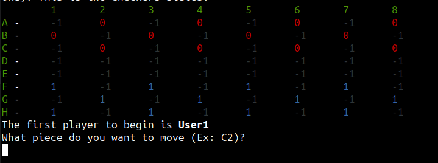

# Checkers
A simple checkers game to learn and improve my skils about Rust!



## Description
This is my first project to improve my skills in Rust. I always use a game to learn a programming language and this time I my choice is a **checker game**.

## Usage
1. Clone this repository
```shell
git clone https://github.com/ccr5/checkers.git
```
2. Install <a href="https://linuxhint.com/rust-programming-language-ubuntu-2204/">dependencies</a>
3. Run Checkers
```shell
cargo run 
```